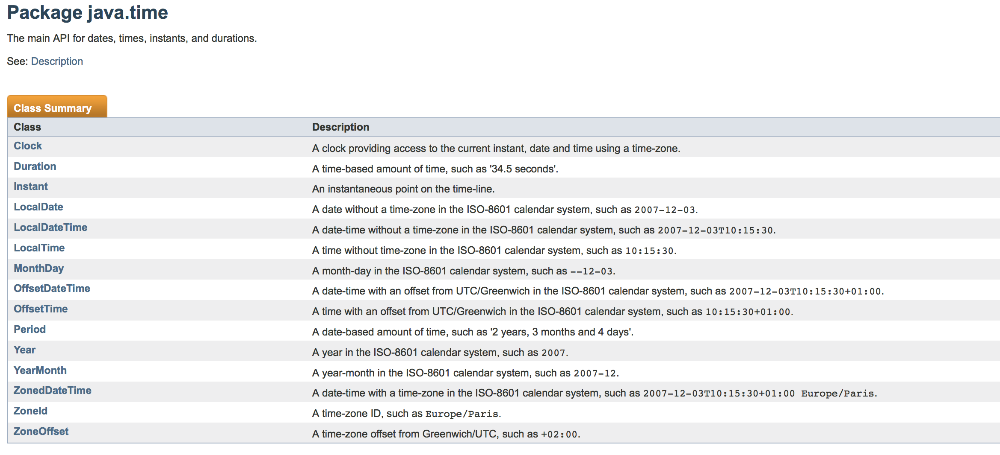
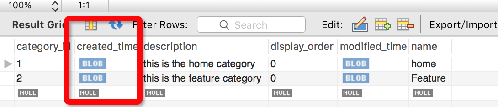

## 1. Introuduce
在java8中，新增了几个时间相关的API，如下：

详情可查看[java doc文档](http://javadocs.techempower.com/jdk18/api/java/time/package-summary.html)

## 2. 使用
新增的几个API，包含了时区信息的类有ZonedDateTime和OffsetDateTime，如果需要保存时区信息，需要使用ZonedDateTime或OffsetDateTime。
下面是ZonedDateTime的简单使用：
```groovy
//new a utc.
ZonedDateTime utc = ZonedDateTime.now(ZoneOffset.UTC)
println "utc:" + utc.toLocalDateTime()

//get local zone.
ZoneId zoneId = ZonedDateTime.now().getZone()
println "local zone:" + zoneId

//convert utc to local time.
ZonedDateTime localDateAndTime = ZonedDateTime.ofInstant(utc.toInstant(), zoneId)
println "utc to local time:" + localDateAndTime.toLocalDateTime()

//new a local time.
ZonedDateTime localDateTime = ZonedDateTime.now();
println "new local time:" + localDateTime

//get utc zone.
ZoneId utcZoneId = utc.getZone()
println "utc zoneid:" + utcZoneId

//convert local time to utc.
ZonedDateTime localUTC = ZonedDateTime.ofInstant(localDateTime.toInstant(), utcZoneId)
println "local time to utc:" + localUTC.toLocalDateTime()

//convert utc from ZonedDateTime to DateTime
Date date = Date.from(utc.toInstant())
println date

//result
utc:2016-09-26T01:27:50.157
local zone:Asia/Shanghai
utc to local time:2016-09-26T09:27:50.157
new local time:2016-09-26T09:27:50.222+08:00[Asia/Shanghai]
utc zoneid:Z
local time to utc:2016-09-26T01:27:50.222
Mon Sep 26 09:27:50 CST 2016

```

## 3. 保存到MySQL
在程序上，保存ZonedDateTime与保存DateTime没有明显的区别（实际上都是JPA来控制，不需要我们自己做很多工作）。
如下：
```java
  /**
   * create time.
   */
  @Column(name = "created_time")
  private ZonedDateTime createdTime;
```
但是保存到数据库（使用的是MySQL），并不是非常友好，保存的类型是非常难读的tinyblob类型。


目前的方案是两个：
1. 使用tinyblob来存储
  在程序上读写ZonedDateTime并没有任何问题，在不需要人为直接查看读写MySQL存储的数据时，直接使用tinyblob即可。
2. 引入hibernate-java8
  由于jpa 2.1是在java 8之前就已经推出了，所以不支持java 8里面新增的时间API，hibernate为了适配java 8，推出了hibernate-java8这个库，可以解决一部分问题，但是引入了新的问题：读取出来的ZonedDateTime，时区会变为当地时区。例如保存当前的UTC时间，读取出来的是UTC转换过来的当地时区时间。